<!---
./feb-cal-kirby = February Calender - Kirby
./snes-classic = The Super NES Classic Edition
./dragon-ball-xeno-2 = DRAGON BALL Xenoverse 2
./arms-black = ARMS - Black Theme
./arms-min-min = ARMS - Min Min
./arms-spring-man = ARMS - Spring Man
./tloz-pack-2 = The Legend of Zelda: Breath of the Wild - The Champions' Ballad DLC Pack 2
./tloz-master-cycle = The Legend of Zelda: Breath of the Wild – The Master Cycle Zero
./xc2-argentum = Xenoblade Chronicles 2 - Argentum Trade Guild
./xc2-uraya = Xenoblade Chronicles 2 – Kingdom of Uraya
./metroid-c = [Wallpaper C] Metroid: Samus Returns
./metroid-d = [Wallpaper D] Metroid: Samus Returns
./smo-red = Super Mario Odyssey (Red Theme)
./smo-white = Super Mario Odyssey (White Theme)
./smo-pixel = Super Mario Odyssey (Pixel Mario)
./star-fox-2 = Star Fox™ 2
./sonic-forces = Sonic Forces
./pkmn-crystal = Pokémon Crystal
./pkmn-usum = Pokémon Ultra Sun™ and Pokémon Ultra Moon™
./few-shield-of-flames = Fire Emblem Warriors – Shield of Flames
./few-worlds-unite = Fire Emblem Warriors – Worlds Unite
--
Landscape
--
1280x1024
1366x768
1920x1080
2560x1440
3840x2160
--
Portrait
--
640x1136
720x1280
750x1334
1080x1920
1242x2208
1440x2560
-->
# Table of Contents
- [February Calender - Kirby](#february-calender---kirby)
- ARMS
  - [Black Theme](#arms---black-theme)
  - [Min Min](#arms---min-min)
  - [Spring Man](#arms---spring-man)
- [SNES Clasic Edition](#the-super-nes-classic-edition)
- [Dragon Ball Xenoverse 2](#dragon-ball-xenoverse-2)
- The Legend of Zelda: Breath of the Wild
  - [The Champions' Ballad DLC Pack 2](#the-legend-of-zelda-breath-of-the-wild---the-champions-ballad-dlc-pack-2)
  - [The Master Cycle Zero](#the-legend-of-zelda-breath-of-the-wild--the-master-cycle-zero)
- Xenoblade Chronicles 2
  - [Argentum Trade Guild](#xenoblade-chronicles-2---argentum-trade-guild)
  - [Kingdom of Uraya](#xenoblade-chronicles-2--kingdom-of-uraya)
- Metroid: Samus Returns
  - [Wallpaper C](#wallpaper-c-metroid-samus-returns)
  - [Wallpaper D](#wallpaper-d-metroid-samus-returns)
- Super Mario Odyssey
  - [Red Theme](#super-mario-odyssey-red)
  - [White Theme](#super-mario-odyssey-white)
  - [Pixel Mario](#super-mario-odyssey-pixel-mario)
- [Star Fox™ 2](#star-fox-2)
- [Sonic Forces](#sonic-forces)
- Pokémon
  - [Pokémon Crystal](#pokémon-crystal)
  - [Pokémon Ultra Sun™ and Pokémon Ultra Moon™](#pokémon-ultra-sun-and-pokémon-ultra-moon)
- Fire Emblem Warriors
  - [Shield of Flames](#fire-emblem-warriors--shield-of-flames)
  - [Worlds Unite](#fire-emblem-warriors--worlds-unite)
  
---

## February Calender - Kirby

### About

N/A

 

 

 

 

 

---

### Landscape (PC/Tablet)

<a href="./nin-wall/feb-cal-kirby/Landscape/1280x1024.jpg" download="February Kirby Calendar (Landscape) - 1280x1024.png">1280x1024</a> | <a href="./nin-wall/feb-cal-kirby/Landscape/1366x768.jpg" download="February Kirby Calendar (Landscape) - 1366x768.png">1366x768</a> | <a href="./nin-wall/feb-cal-kirby/Landscape/1920x1080.jpg" download="February Kirby Calendar (Landscape) - 1920x1080.png">1920x1080</a> | <a href="./nin-wall/feb-cal-kirby/Landscape/2560x1440.jpg" download="February Kirby Calendar (Landscape) - 2560x1440.png">2560x1440</a> | <a href="./nin-wall/feb-cal-kirby/Landscape/3840x2160.jpg" download="February Kirby Calendar (Landscape) - 3840x2160.png">3840x2160</a>

---

### Portrait (Mobile)

<a href="./nin-wall/feb-cal-kirby/Portrait/640x1136.jpg" download="February Kirby Calendar (Portrait) - 640x1136.png">640x1136</a> | <a href="./nin-wall/feb-cal-kirby/Portrait/720x1280.jpg" download="February Kirby Calendar (Portrait) - 720x1280.png">720x1280</a> | <a href="./nin-wall/feb-cal-kirby/Portrait/750x1334.jpg" download="February Kirby Calendar (Portrait) - 750x1334.png">750x1334</a> | <a href="./nin-wall/feb-cal-kirby/Portrait/1080x1920.jpg" download="February Kirby Calendar (Portrait) - 1080x1920.png">1080x1920</a> | <a href="./nin-wall/feb-cal-kirby/Portrait/1242x2208.jpg" download="February Kirby Calendar (Portrait) - 1242x2208.png">1242x2208</a> | <a href="./nin-wall/feb-cal-kirby/Portrait/1440x2560.jpg" download="February Kirby Calendar (Portrait) - 1440x2560.png">1440x2560</a>

---

---

## The Super NES Classic Edition

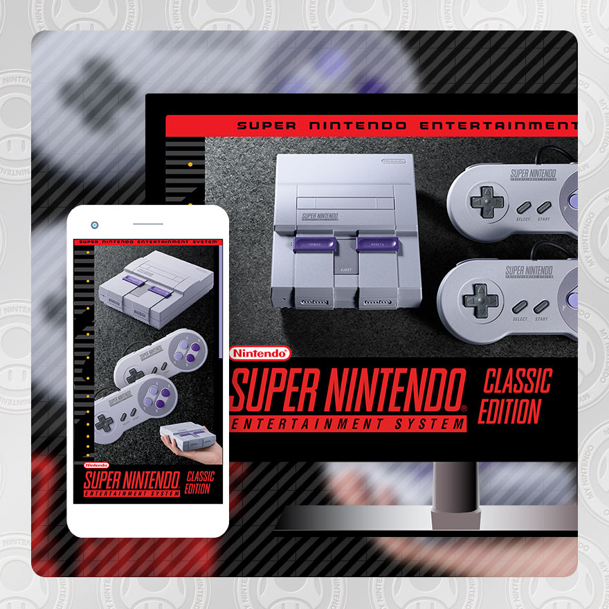

### About

The wait is finally over. The Super NES Classic Edition system is now available! Play 20 classic Super NES games, plus the never-before-released Star Fox™ 2 game. For more information about the game, visit [official site](https://www.nintendo.com/super-nes-classic).

 

 

 

---

### Landscape (PC/Tablet)

<a href="./nin-wall/snes-classic/Landscape/1280x1024.jpg" download="The Super NES Classic Edition (Landscape) - 1280x1024.png">1280x1024</a> | <a href="./nin-wall/snes-classic/Landscape/1366x768.jpg" download="The Super NES Classic Edition (Landscape) - 1366x768.png">1366x768</a> | <a href="./nin-wall/snes-classic/Landscape/1920x1080.jpg" download="The Super NES Classic Edition (Landscape) - 1920x1080.png">1920x1080</a> | <a href="./nin-wall/snes-classic/Landscape/2560x1440.jpg" download="The Super NES Classic Edition (Landscape) - 2560x1440.png">2560x1440</a> | <a href="./nin-wall/fsnes-classic/Landscape/3840x2160.jpg" download="The Super NES Classic Edition (Landscape) - 3840x2160.png">3840x2160</a>

---

### Portrait (Mobile)

<a href="./nin-wall/snes-classic/Portrait/640x1136.jpg" download="The Super NES Classic Edition (Portrait) - 640x1136.png">640x1136</a> | <a href="./nin-wall/snes-classic/Portrait/720x1280.jpg" download="The Super NES Classic Edition (Portrait) - 720x1280.png">720x1280</a> | <a href="./nin-wall/snes-classic/Portrait/750x1334.jpg" download="The Super NES Classic Edition (Portrait) - 750x1334.png">750x1334</a> | <a href="./nin-wall/snes-classic/Portrait/1080x1920.jpg" download="The Super NES Classic Edition (Portrait) - 1080x1920.png">1080x1920</a> | <a href="./nin-wall/snes-classic/Portrait/1242x2208.jpg" download="The Super NES Classic Edition (Portrait) - 1242x2208.png">1242x2208</a> | <a href="./nin-wall/snes-classic/Portrait/1440x2560.jpg" download="The Super NES Classic Edition (Portrait) - 1440x2560.png">1440x2560</a>

---

---

## DRAGON BALL Xenoverse 2

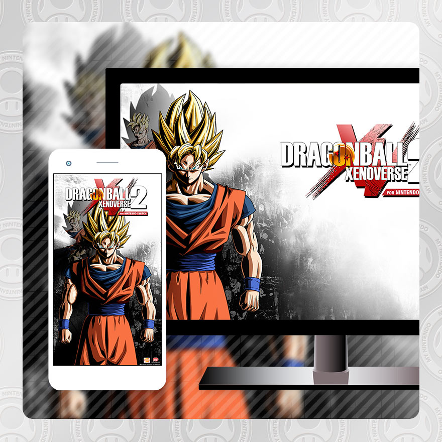

### About

What is [DRAGON BALL Xenoverse 2](http://www.nintendo.com/games/detail/dragon-ball-xenoverse-2-switch)?
The wait is over. It's time to fight! Become a Time Patroller in order to preserve DRAGON BALL’s history in this unprecedented experience. You are the protagonist! Stand with Goku and his friends as you battle a new enemy that has been warping DRAGON BALL’s history. Fight alongside famous fighters from Z, Super, GT, and more, including movie-only characters like Turles, Broly, and Janemba, the mysterious Masked Saiyan, and many others.

 

---

### Landscape (PC/Tablet)

<a href="./nin-wall/dragon-ball-xeno-2/Landscape/1280x1024.jpg" download="DRAGON BALL Xenoverse 2 (Landscape) - 1280x1024.png">1280x1024</a> | <a href="./nin-wall/dragon-ball-xeno-2/Landscape/1366x768.jpg" download="DRAGON BALL Xenoverse 2 (Landscape) - 1366x768.png">1366x768</a> | <a href="./nin-wall/dragon-ball-xeno-2/Landscape/1920x1080.jpg" download="DRAGON BALL Xenoverse 2 (Landscape) - 1920x1080.png">1920x1080</a> | <a href="./nin-wall/dragon-ball-xeno-2/Landscape/2560x1440.jpg" download="DRAGON BALL Xenoverse 2 (Landscape) - 2560x1440.png">2560x1440</a> | <a href="./nin-wall/dragon-ball-xeno-2/Landscape/3840x2160.jpg" download="DRAGON BALL Xenoverse 2 (Landscape) - 3840x2160.png">3840x2160</a>

---

### Portrait (Mobile)

<a href="./nin-wall/dragon-ball-xeno-2/Portrait/640x1136.jpg" download="DRAGON BALL Xenoverse 2 (Portrait) - 640x1136.png">640x1136</a> | <a href="./nin-wall/dragon-ball-xeno-2/Portrait/720x1280.jpg" download="DRAGON BALL Xenoverse 2 (Portrait) - 720x1280.png">720x1280</a> | <a href="./nin-wall/dragon-ball-xeno-2/Portrait/750x1334.jpg" download="DRAGON BALL Xenoverse 2 (Portrait) - 750x1334.png">750x1334</a> | <a href="./nin-wall/dragon-ball-xeno-2/Portrait/1080x1920.jpg" download="DRAGON BALL Xenoverse 2 (Portrait) - 1080x1920.png">1080x1920</a> | <a href="./nin-wall/dragon-ball-xeno-2/Portrait/1242x2208.jpg" download="DRAGON BALL Xenoverse 2 (Portrait) - 1242x2208.png">1242x2208</a> | <a href="./nin-wall/dragon-ball-xeno-2/Portrait/1440x2560.jpg" download="DRAGON BALL Xenoverse 2 (Portrait) - 1440x2560.png">1440x2560</a>

---

---
## ARMS - Black Theme

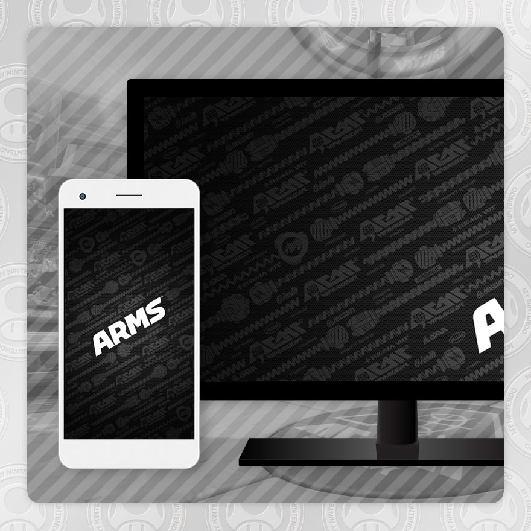

### About ARMS

Fighting superstars from around the world share one thing in common: extendable arms! So fight as never before: equip each arm of each fighter with a super-powered weapon to create a slew of unprecedented combinations. Then use simple motion or button controls to dish out highly strategic beatdowns in 1-on-1, or even 2-on-2 battles!* For more information about the game, visit the [Official Site](http://arms.nintendo.com/).

 

---

### Landscape (PC/Tablet)

<a href="./nin-wall/arms-black/Landscape/1280x1024.jpg" download="ARMS - Black Theme (Landscape) - 1280x1024.png">1280x1024</a> | <a href="./nin-wall/arms-black/Landscape/1366x768.jpg" download="ARMS - Black Theme (Landscape) - 1366x768.png">1366x768</a> | <a href="./nin-wall/arms-black/Landscape/1920x1080.jpg" download="ARMS - Black Theme (Landscape) - 1920x1080.png">1920x1080</a> | <a href="./nin-wall/arms-black/Landscape/2560x1440.jpg" download="ARMS - Black Theme (Landscape) - 2560x1440.png">2560x1440</a> | <a href="./nin-wall/arms-black/Landscape/3840x2160.jpg" download="ARMS - Black Theme (Landscape) - 3840x2160.png">3840x2160</a>

---

### Portrait (Mobile)

<a href="./nin-wall/arms-black/Portrait/640x1136.jpg" download="ARMS - Black Theme (Portrait) - 640x1136.png">640x1136</a> | <a href="./nin-wall/arms-black/Portrait/720x1280.jpg" download="ARMS - Black Theme (Portrait) - 720x1280.png">720x1280</a> | <a href="./nin-wall/arms-black/Portrait/750x1334.jpg" download="ARMS - Black Theme (Portrait) - 750x1334.png">750x1334</a> | <a href="./nin-wall/arms-black/Portrait/1080x1920.jpg" download="ARMS - Black Theme (Portrait) - 1080x1920.png">1080x1920</a> | <a href="./nin-wall/arms-black/Portrait/1242x2208.jpg" download="ARMS - Black Theme (Portrait) - 1242x2208.png">1242x2208</a> | <a href="./nin-wall/arms-black/Portrait/1440x2560.jpg" download="ARMS - Black Theme (Portrait) - 1440x2560.png">1440x2560</a>

---

---

## ARMS - Min Min

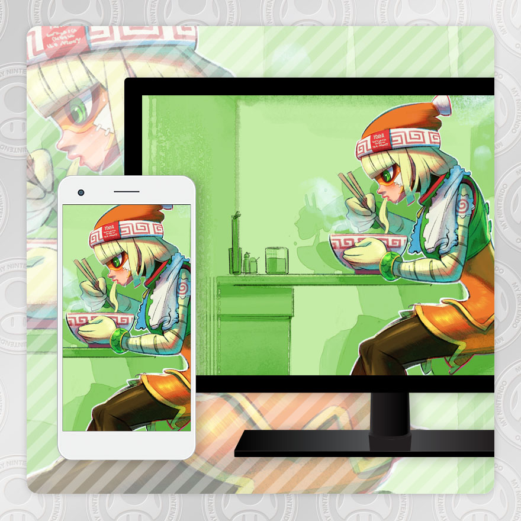

### About ARMS

Fighting superstars from around the world share one thing in common: extendable arms! So fight as never before: equip each arm of each fighter with a super-powered weapon to create a slew of unprecedented combinations. Then use simple motion or button controls to dish out highly strategic beatdowns in 1-on-1, or even 2-on-2 battles!* For more information about the game, visit the [Official Site](http://arms.nintendo.com/).

 

---

### Landscape (PC/Tablet)

<a href="./nin-wall/arms-min-min/Landscape/1280x1024.jpg" download="ARMS - Min Min (Landscape) - 1280x1024.png">1280x1024</a> | <a href="./nin-wall/arms-min-min/Landscape/1366x768.jpg" download="ARMS - Min Min (Landscape) - 1366x768.png">1366x768</a> | <a href="./nin-wall/arms-min-min/Landscape/1920x1080.jpg" download="ARMS - Min Min (Landscape) - 1920x1080.png">1920x1080</a> | <a href="./nin-wall/arms-min-min/Landscape/2560x1440.jpg" download="ARMS - Min Min (Landscape) - 2560x1440.png">2560x1440</a> | <a href="./nin-wall/arms-min-min/Landscape/3840x2160.jpg" download="ARMS - Min Min (Landscape) - 3840x2160.png">3840x2160</a>

---

### Portrait (Mobile)

<a href="./nin-wall/arms-min-min/Portrait/640x1136.jpg" download="ARMS - Min Min (Portrait) - 640x1136.png">640x1136</a> | <a href="./nin-wall/arms-min-min/Portrait/720x1280.jpg" download="ARMS - Min Min (Portrait) - 720x1280.png">720x1280</a> | <a href="./nin-wall/arms-min-min/Portrait/750x1334.jpg" download="ARMS - Min Min (Portrait) - 750x1334.png">750x1334</a> | <a href="./nin-wall/arms-min-min/Portrait/1080x1920.jpg" download="ARMS - Min Min (Portrait) - 1080x1920.png">1080x1920</a> | <a href="./nin-wall/arms-min-min/Portrait/1242x2208.jpg" download="ARMS - Min Min (Portrait) - 1242x2208.png">1242x2208</a> | <a href="./nin-wall/arms-min-min/Portrait/1440x2560.jpg" download="ARMS - Min Min (Portrait) - 1440x2560.png">1440x2560</a>

---

---

## ARMS - Spring Man

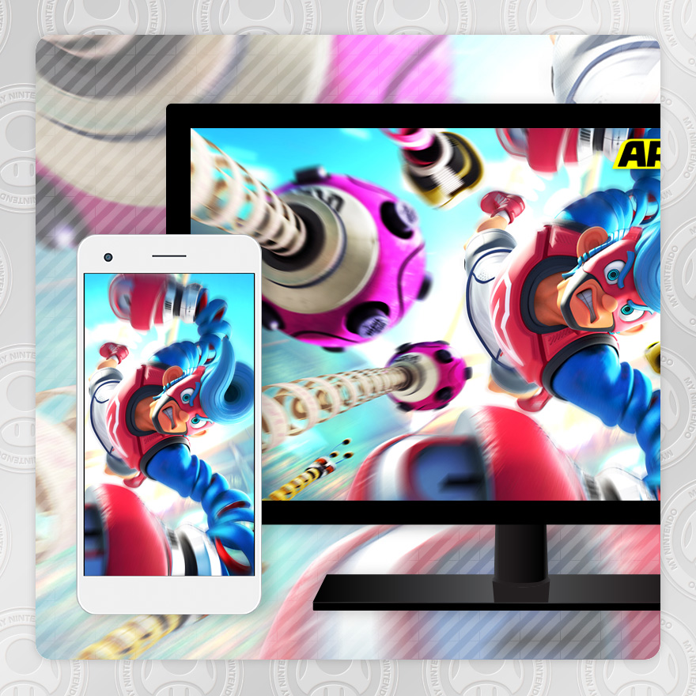

### About ARMS

Fighting superstars from around the world share one thing in common: extendable arms! So fight as never before: equip each arm of each fighter with a super-powered weapon to create a slew of unprecedented combinations. Then use simple motion or button controls to dish out highly strategic beatdowns in 1-on-1, or even 2-on-2 battles!* For more information about the game, visit the [Official Site](http://arms.nintendo.com/).

 

---

### Landscape (PC/Tablet)

<a href="./nin-wall/arms-spring-man/Landscape/1280x1024.jpg" download="ARMS - Spring Man (Landscape) - 1280x1024.png">1280x1024</a> | <a href="./nin-wall/arms-spring-man/Landscape/1366x768.jpg" download="ARMS - Spring Man (Landscape) - 1366x768.png">1366x768</a> | <a href="./nin-wall/arms-spring-man/Landscape/1920x1080.jpg" download="ARMS - Spring Man (Landscape) - 1920x1080.png">1920x1080</a> | <a href="./nin-wall/arms-spring-man/Landscape/2560x1440.jpg" download="ARMS - Spring Man (Landscape) - 2560x1440.png">2560x1440</a> | <a href="./nin-wall/arms-spring-man/Landscape/3840x2160.jpg" download="ARMS - Spring Man (Landscape) - 3840x2160.png">3840x2160</a>

---

### Portrait (Mobile)

<a href="./nin-wall/arms-spring-man/Portrait/640x1136.jpg" download="ARMS - Spring Man (Portrait) - 640x1136.png">640x1136</a> | <a href="./nin-wall/arms-spring-man/Portrait/720x1280.jpg" download="ARMS - Spring Man (Portrait) - 720x1280.png">720x1280</a> | <a href="./nin-wall/arms-spring-man/Portrait/750x1334.jpg" download="ARMS - Spring Man (Portrait) - 750x1334.png">750x1334</a> | <a href="./nin-wall/arms-spring-man/Portrait/1080x1920.jpg" download="ARMS - Spring Man (Portrait) - 1080x1920.png">1080x1920</a> | <a href="./nin-wall/arms-spring-man/Portrait/1242x2208.jpg" download="ARMS - Spring Man (Portrait) - 1242x2208.png">1242x2208</a> | <a href="./nin-wall/arms-spring-man/Portrait/1440x2560.jpg" download="ARMS - Spring Man (Portrait) - 1440x2560.png">1440x2560</a>

---

---

## The Legend of Zelda: Breath of the Wild - The Champions' Ballad DLC Pack 2

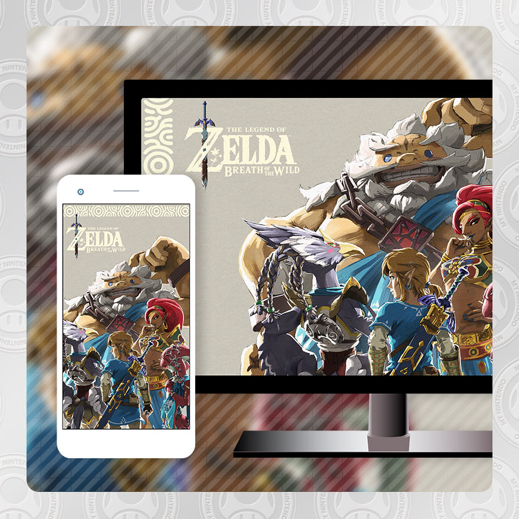

### About

Extend your unforgettable adventure in Hyrule with The Legend of Zelda: Breath of the Wild Expansion Pass. The Expansion Pass grants access to three new treasure chests and two DLC packs as they are released. The Expansion Pass is available for both the Nintendo Switch™ and Wii U™ versions of the game.

The Champions' Ballad DLC Pack 2 contains a new dungeon, an original story, and more challenges. __Now Available__!

 

*Full version of game required to use DLC. For more info, please visit the [official site](http://www.zelda.com/breath-of-the-wild/expansion-pass/). 

---

### Landscape (PC/Tablet)

<a href="./nin-wall/tloz-botw-pack-2/Landscape/1280x1024.jpg" download="The Legend of Zelda: Breath of the Wild - The Champions' Ballad DLC Pack 2 (Landscape) - 1280x1024.png">1280x1024</a> | <a href="./nin-wall/tloz-botw-pack-2/Landscape/1366x768.jpg" download="The Legend of Zelda: Breath of the Wild - The Champions' Ballad DLC Pack 2 (Landscape) - 1366x768.png">1366x768</a> | <a href="./nin-wall/tloz-botw-pack-2/Landscape/1920x1080.jpg" download="The Legend of Zelda: Breath of the Wild - The Champions' Ballad DLC Pack 2 (Landscape) - 1920x1080.png">1920x1080</a> | <a href="./nin-wall/tloz-botw-pack-2/Landscape/2560x1440.jpg" download="The Legend of Zelda: Breath of the Wild - The Champions' Ballad DLC Pack 2 (Landscape) - 2560x1440.png">2560x1440</a> | <a href="./nin-wall/tloz-botw-pack-2/Landscape/3840x2160.jpg" download="The Legend of Zelda: Breath of the Wild - The Champions' Ballad DLC Pack 2 (Landscape) - 3840x2160.png">3840x2160</a>

---

### Portrait (Mobile)

<a href="./nin-wall/tloz-botw-pack-2/Portrait/640x1136.jpg" download="The Legend of Zelda: Breath of the Wild - The Champions' Ballad DLC Pack 2 (Portrait) - 640x1136.png">640x1136</a> | <a href="./nin-wall/tloz-botw-pack-2/Portrait/720x1280.jpg" download="The Legend of Zelda: Breath of the Wild - The Champions' Ballad DLC Pack 2 (Portrait) - 720x1280.png">720x1280</a> | <a href="./nin-wall/tloz-botw-pack-2/Portrait/750x1334.jpg" download="The Legend of Zelda: Breath of the Wild - The Champions' Ballad DLC Pack 2 (Portrait) - 750x1334.png">750x1334</a> | <a href="./nin-wall/tloz-botw-pack-2/Portrait/1080x1920.jpg" download="The Legend of Zelda: Breath of the Wild - The Champions' Ballad DLC Pack 2 (Portrait) - 1080x1920.png">1080x1920</a> | <a href="./nin-wall/tloz-botw-pack-2/Portrait/1242x2208.jpg" download="The Legend of Zelda: Breath of the Wild - The Champions' Ballad DLC Pack 2 (Portrait) - 1242x2208.png">1242x2208</a> | <a href="./nin-wall/tloz-botw-pack-2/Portrait/1440x2560.jpg" download="The Legend of Zelda: Breath of the Wild - The Champions' Ballad DLC Pack 2 (Portrait) - 1440x2560.png">1440x2560</a>

---

---

## The Legend of Zelda: Breath of the Wild – The Master Cycle Zero

### About

Extend your unforgettable adventure in Hyrule with The Legend of Zelda: Breath of the Wild Expansion Pass. The Expansion Pass grants access to three new treasure chests and two DLC packs as they are released. The Expansion Pass is available for both the Nintendo Switch™ and Wii U™ versions of the game.

The Champions' Ballad DLC Pack 2 contains a new dungeon, an original story, and more challenges. __Now Available__!

 

*Full version of game required to use DLC. For more info, please visit the [official site](http://www.zelda.com/breath-of-the-wild/expansion-pass/). 

---

### Landscape (PC/Tablet)

<a href="./nin-wall/tloz-botw-master-cycle/Landscape/1280x1024.jpg" download="The Legend of Zelda: Breath of the Wild – The Master Cycle Zero (Landscape) - 1280x1024.png">1280x1024</a> | <a href="./nin-wall/tloz-botw-master-cycle/Landscape/1366x768.jpg" download="The Legend of Zelda: Breath of the Wild – The Master Cycle Zero (Landscape) - 1366x768.png">1366x768</a> | <a href="./nin-wall/tloz-botw-master-cycle/Landscape/1920x1080.jpg" download="The Legend of Zelda: Breath of the Wild – The Master Cycle Zero (Landscape) - 1920x1080.png">1920x1080</a> | <a href="./nin-wall/tloz-botw-master-cycle/Landscape/2560x1440.jpg" download="The Legend of Zelda: Breath of the Wild – The Master Cycle Zero (Landscape) - 2560x1440.png">2560x1440</a> | <a href="./nin-wall/tloz-botw-master-cycle/Landscape/3840x2160.jpg" download="The Legend of Zelda: Breath of the Wild – The Master Cycle Zero (Landscape) - 3840x2160.png">3840x2160</a>

---

### Portrait (Mobile)

<a href="./nin-wall/tloz-botw-master-cycle/Portrait/640x1136.jpg" download="The Legend of Zelda: Breath of the Wild – The Master Cycle Zero (Portrait) - 640x1136.png">640x1136</a> | <a href="./nin-wall/tloz-botw-master-cycle/Portrait/720x1280.jpg" download="The Legend of Zelda: Breath of the Wild – The Master Cycle Zero (Portrait) - 720x1280.png">720x1280</a> | <a href="./nin-wall/tloz-botw-master-cycle/Portrait/750x1334.jpg" download="The Legend of Zelda: Breath of the Wild – The Master Cycle Zero (Portrait) - 750x1334.png">750x1334</a> | <a href="./nin-wall/tloz-botw-master-cycle/Portrait/1080x1920.jpg" download="The Legend of Zelda: Breath of the Wild – The Master Cycle Zero (Portrait) - 1080x1920.png">1080x1920</a> | <a href="./nin-wall/tloz-botw-master-cycle/Portrait/1242x2208.jpg" download="The Legend of Zelda: Breath of the Wild – The Master Cycle Zero (Portrait) - 1242x2208.png">1242x2208</a> | <a href="./nin-wall/tloz-botw-master-cycle/Portrait/1440x2560.jpg" download="The Legend of Zelda: Breath of the Wild – The Master Cycle Zero (Portrait) - 1440x2560.png">1440x2560</a>

---

---

## Xenoblade Chronicles 2 - Argentum Trade Guild

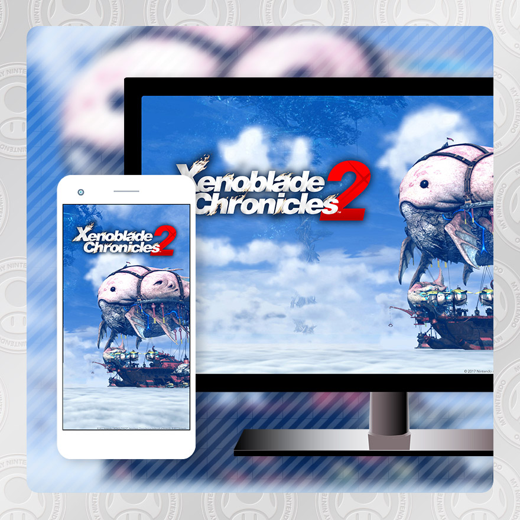

### About

Lead Rex, Pyra, and the world to refuge

As the giant beasts march toward death, the last hope is a scavenger named Rex—and Pyra, a living weapon known as a Blade. Can you find the fabled paradise she calls home? Command a group of Blades and lead them to countless strategic victories before the world ends.

 

Each Titan hosts its own distinct cultures, wildlife, and diverse regions to explore. Search the vast open areas and labyrinthine corridors for treasure, secret paths, and creatures to battle and index.

During these escapades you'll get to know a large cast of eclectic characters, including the weaponized life forms known as Blades. Gather these allies, bond with them to increase their power, and utilize their special ARTS to devastate enemies. But to save the world of Alrest, you must first demystify its cloudy past.

For more info, please visit the [official site](https://xenobladechronicles2.nintendo.com/).

---

### Landscape (PC/Tablet)

<a href="./nin-wall/xc2-argentum/Landscape/1280x1024.jpg" download="Xenoblade Chronicles 2 - Argentum Trade Guild (Landscape) - 1280x1024.png">1280x1024</a> | <a href="./nin-wall/xc2-argentum/Landscape/1366x768.jpg" download="Xenoblade Chronicles 2 - Argentum Trade Guild (Landscape) - 1366x768.png">1366x768</a> | <a href="./nin-wall/xc2-argentum/Landscape/1920x1080.jpg" download="Xenoblade Chronicles 2 - Argentum Trade Guild (Landscape) - 1920x1080.png">1920x1080</a> | <a href="./nin-wall/xc2-argentum/Landscape/2560x1440.jpg" download="Xenoblade Chronicles 2 - Argentum Trade Guild (Landscape) - 2560x1440.png">2560x1440</a> | <a href="./nin-wall/xc2-argentum/Landscape/3840x2160.jpg" download="Xenoblade Chronicles 2 - Argentum Trade Guild (Landscape) - 3840x2160.png">3840x2160</a>

---

### Portrait (Mobile)

<a href="./nin-wall/xc2-argentum/Portrait/640x1136.jpg" download="Xenoblade Chronicles 2 - Argentum Trade Guild (Portrait) - 640x1136.png">640x1136</a> | <a href="./nin-wall/xc2-argentum/Portrait/720x1280.jpg" download="Xenoblade Chronicles 2 - Argentum Trade Guild (Portrait) - 720x1280.png">720x1280</a> | <a href="./nin-wall/xc2-argentum/Portrait/750x1334.jpg" download="Xenoblade Chronicles 2 - Argentum Trade Guild (Portrait) - 750x1334.png">750x1334</a> | <a href="./nin-wall/xc2-argentum/Portrait/1080x1920.jpg" download="Xenoblade Chronicles 2 - Argentum Trade Guild (Portrait) - 1080x1920.png">1080x1920</a> | <a href="./nin-wall/xc2-argentum/Portrait/1242x2208.jpg" download="Xenoblade Chronicles 2 - Argentum Trade Guild (Portrait) - 1242x2208.png">1242x2208</a> | <a href="./nin-wall/xc2-argentum/Portrait/1440x2560.jpg" download="Xenoblade Chronicles 2 - Argentum Trade Guild (Portrait) - 1440x2560.png">1440x2560</a>

---

---

## Xenoblade Chronicles 2 – Kingdom of Uraya

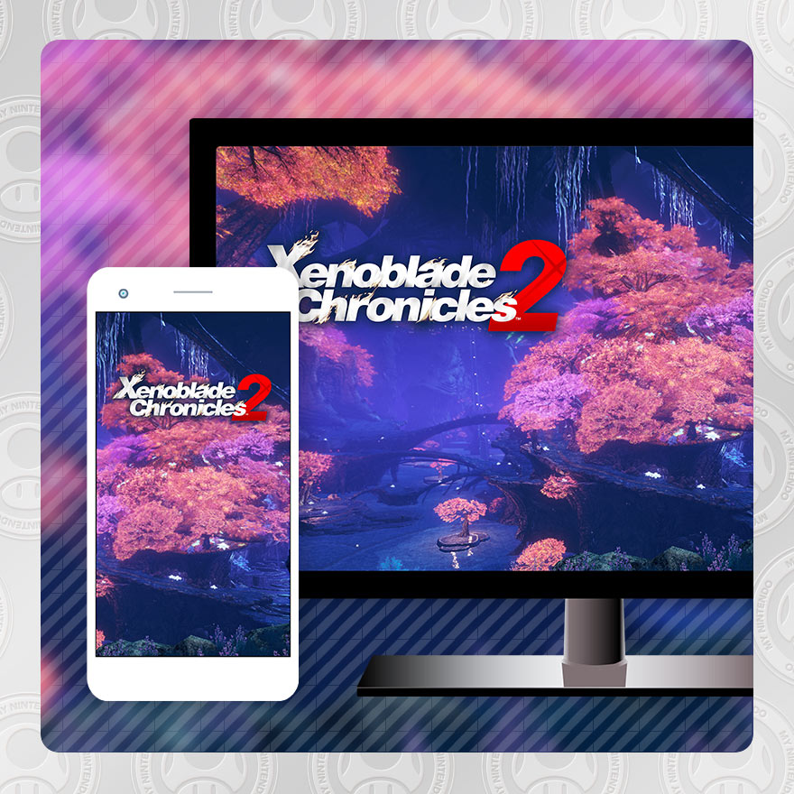

### About

Lead Rex, Pyra, and the world to refuge

As the giant beasts march toward death, the last hope is a scavenger named Rex—and Pyra, a living weapon known as a Blade. Can you find the fabled paradise she calls home? Command a group of Blades and lead them to countless strategic victories before the world ends.

 

Each Titan hosts its own distinct cultures, wildlife, and diverse regions to explore. Search the vast open areas and labyrinthine corridors for treasure, secret paths, and creatures to battle and index.

During these escapades you'll get to know a large cast of eclectic characters, including the weaponized life forms known as Blades. Gather these allies, bond with them to increase their power, and utilize their special ARTS to devastate enemies. But to save the world of Alrest, you must first demystify its cloudy past.

For more info, please visit the [official site](https://xenobladechronicles2.nintendo.com/).

---

### Landscape (PC/Tablet)

<a href="./nin-wall/xc2-uraya/Landscape/1280x1024.jpg" download="Xenoblade Chronicles 2 – Kingdom of Uraya (Landscape) - 1280x1024.png">1280x1024</a> | <a href="./nin-wall/xc2-uraya/Landscape/1366x768.jpg" download="Xenoblade Chronicles 2 – Kingdom of Uraya (Landscape) - 1366x768.png">1366x768</a> | <a href="./nin-wall/xc2-uraya/Landscape/1920x1080.jpg" download="Xenoblade Chronicles 2 – Kingdom of Uraya (Landscape) - 1920x1080.png">1920x1080</a> | <a href="./nin-wall/xc2-uraya/Landscape/2560x1440.jpg" download="Xenoblade Chronicles 2 – Kingdom of Uraya (Landscape) - 2560x1440.png">2560x1440</a> | <a href="./nin-wall/xc2-uraya/Landscape/3840x2160.jpg" download="Xenoblade Chronicles 2 – Kingdom of Uraya (Landscape) - 3840x2160.png">3840x2160</a>

---

### Portrait (Mobile)

<a href="./nin-wall/xc2-uraya/Portrait/640x1136.jpg" download="Xenoblade Chronicles 2 – Kingdom of Uraya (Portrait) - 640x1136.png">640x1136</a> | <a href="./nin-wall/xc2-uraya/Portrait/720x1280.jpg" download="Xenoblade Chronicles 2 – Kingdom of Uraya (Portrait) - 720x1280.png">720x1280</a> | <a href="./nin-wall/xc2-uraya/Portrait/750x1334.jpg" download="Xenoblade Chronicles 2 – Kingdom of Uraya (Portrait) - 750x1334.png">750x1334</a> | <a href="./nin-wall/xc2-uraya/Portrait/1080x1920.jpg" download="Xenoblade Chronicles 2 – Kingdom of Uraya (Portrait) - 1080x1920.png">1080x1920</a> | <a href="./nin-wall/xc2-uraya/Portrait/1242x2208.jpg" download="Xenoblade Chronicles 2 – Kingdom of Uraya (Portrait) - 1242x2208.png">1242x2208</a> | <a href="./nin-wall/xc2-uraya/Portrait/1440x2560.jpg" download="Xenoblade Chronicles 2 – Kingdom of Uraya (Portrait) - 1440x2560.png">1440x2560</a>

---

---

## [Wallpaper C] Metroid: Samus Returns

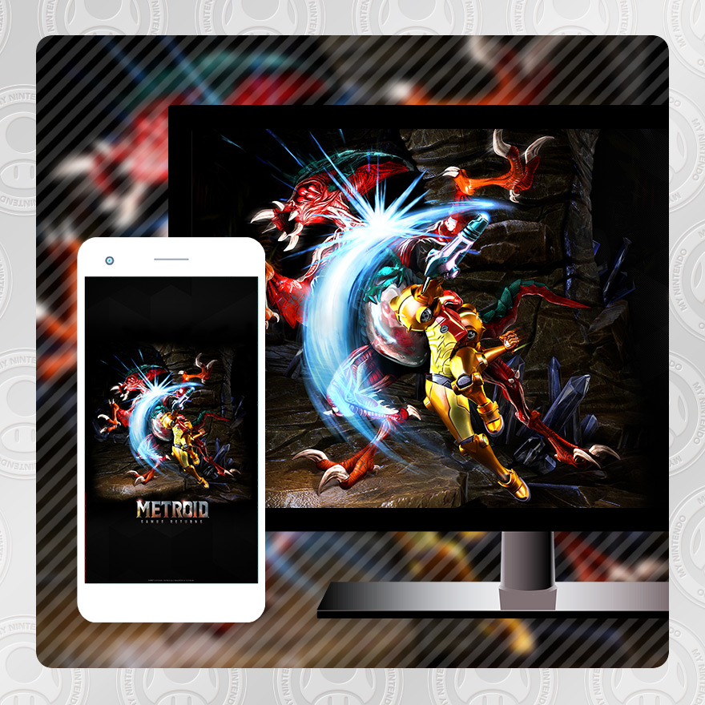

### About

A classic Metroid adventure returns, rebuilt from the ground up!

Brave the hostile terrain of an alien planet teeming with vicious life forms as legendary bounty hunter Samus Aran. 

Her mission? Terminate the Metroid menace in this masterful reimagining of her 1991 Game Boy™ adventure. 

Samus Aran's arsenal has been enhanced with new moves and abilities that are sure to help her face the deadly surprises that await. 

This intense, side-scrolling action platformer is a great entry point into the Metroid franchise and perfect for returning fans as well, and it's available only on the Nintendo 3DS family of systems.

---

### Landscape (PC/Tablet)

<a href="./nin-wall/metroid-c/Landscape/1280x1024.jpg" download="[Wallpaper C] Metroid: Samus Returns (Landscape) - 1280x1024.png">1280x1024</a> | <a href="./nin-wall/metroid-c/Landscape/1366x768.jpg" download="[Wallpaper C] Metroid: Samus Returns (Landscape) - 1366x768.png">1366x768</a> | <a href="./nin-wall/metroid-c/Landscape/1920x1080.jpg" download="[Wallpaper C] Metroid: Samus Returns (Landscape) - 1920x1080.png">1920x1080</a> | <a href="./nin-wall/metroid-c/Landscape/2560x1440.jpg" download="[Wallpaper C] Metroid: Samus Returns (Landscape) - 2560x1440.png">2560x1440</a> | <a href="./nin-wall/metroid-c/Landscape/3840x2160.jpg" download="[Wallpaper C] Metroid: Samus Returns (Landscape) - 3840x2160.png">3840x2160</a>

---

### Portrait (Mobile)

<a href="./nin-wall/metroid-c/Portrait/640x1136.jpg" download="[Wallpaper C] Metroid: Samus Returns (Portrait) - 640x1136.png">640x1136</a> | <a href="./nin-wall/metroid-c/Portrait/720x1280.jpg" download="[Wallpaper C] Metroid: Samus Returns (Portrait) - 720x1280.png">720x1280</a> | <a href="./nin-wall/metroid-c/Portrait/750x1334.jpg" download="[Wallpaper C] Metroid: Samus Returns (Portrait) - 750x1334.png">750x1334</a> | <a href="./nin-wall/metroid-c/Portrait/1080x1920.jpg" download="[Wallpaper C] Metroid: Samus Returns (Portrait) - 1080x1920.png">1080x1920</a> | <a href="./nin-wall/metroid-c/Portrait/1242x2208.jpg" download="[Wallpaper C] Metroid: Samus Returns (Portrait) - 1242x2208.png">1242x2208</a> | <a href="./nin-wall/metroid-c/Portrait/1440x2560.jpg" download="[Wallpaper C] Metroid: Samus Returns (Portrait) - 1440x2560.png">1440x2560</a>

---

---

## [Wallpaper D] Metroid: Samus Returns

### About

A classic Metroid adventure returns, rebuilt from the ground up!

Brave the hostile terrain of an alien planet teeming with vicious life forms as legendary bounty hunter Samus Aran. 

Her mission? Terminate the Metroid menace in this masterful reimagining of her 1991 Game Boy™ adventure. 

Samus Aran's arsenal has been enhanced with new moves and abilities that are sure to help her face the deadly surprises that await. 

This intense, side-scrolling action platformer is a great entry point into the Metroid franchise and perfect for returning fans as well, and it's available only on the Nintendo 3DS family of systems.

---

### Landscape (PC/Tablet)

<a href="./nin-wall/metroid-d/Landscape/1280x1024.jpg" download="[Wallpaper D] Metroid: Samus Returns (Landscape) - 1280x1024.png">1280x1024</a> | <a href="./nin-wall/metroid-d/Landscape/1366x768.jpg" download="[Wallpaper D] Metroid: Samus Returns (Landscape) - 1366x768.png">1366x768</a> | <a href="./nin-wall/metroid-d/Landscape/1920x1080.jpg" download="[Wallpaper D] Metroid: Samus Returns (Landscape) - 1920x1080.png">1920x1080</a> | <a href="./nin-wall/metroid-d/Landscape/2560x1440.jpg" download="[Wallpaper D] Metroid: Samus Returns (Landscape) - 2560x1440.png">2560x1440</a> | <a href="./nin-wall/metroid-d/Landscape/3840x2160.jpg" download="[Wallpaper D] Metroid: Samus Returns (Landscape) - 3840x2160.png">3840x2160</a>

---

### Portrait (Mobile)

<a href="./nin-wall/metroid-d/Portrait/640x1136.jpg" download="[Wallpaper D] Metroid: Samus Returns (Portrait) - 640x1136.png">640x1136</a> | <a href="./nin-wall/metroid-d/Portrait/720x1280.jpg" download="[Wallpaper D] Metroid: Samus Returns (Portrait) - 720x1280.png">720x1280</a> | <a href="./nin-wall/metroid-d/Portrait/750x1334.jpg" download="[Wallpaper D] Metroid: Samus Returns (Portrait) - 750x1334.png">750x1334</a> | <a href="./nin-wall/metroid-d/Portrait/1080x1920.jpg" download="[Wallpaper D] Metroid: Samus Returns (Portrait) - 1080x1920.png">1080x1920</a> | <a href="./nin-wall/metroid-d/Portrait/1242x2208.jpg" download="[Wallpaper D] Metroid: Samus Returns (Portrait) - 1242x2208.png">1242x2208</a> | <a href="./nin-wall/metroid-d/Portrait/1440x2560.jpg" download="[Wallpaper D] Metroid: Samus Returns (Portrait) - 1440x2560.png">1440x2560</a>

---

---

## Super Mario Odyssey (Red Theme)

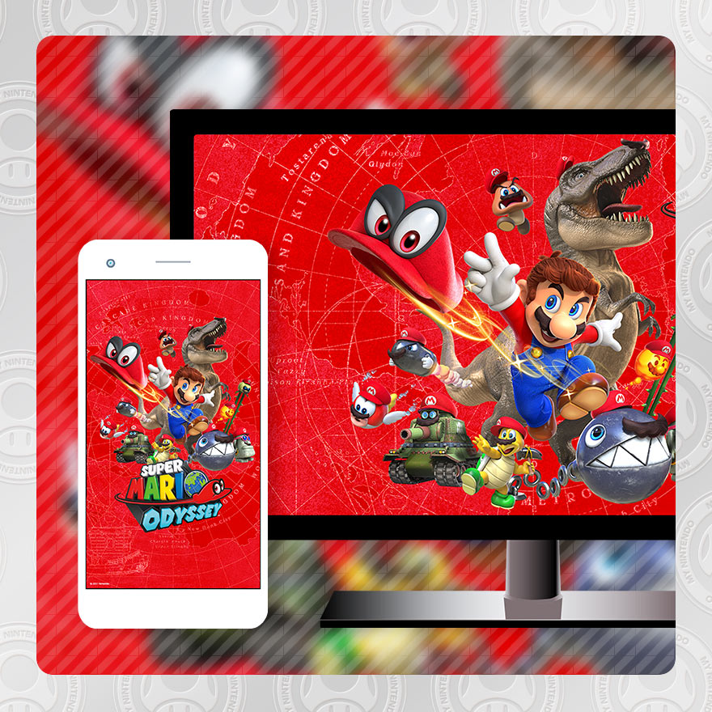

### About

Explore incredible places far from the Mushroom Kingdom as you join Mario and his new ally Cappy on a massive, globe-trotting 3D adventure. 

Use amazing new abilities—like the power to capture and control objects, animals, and enemies—to collect Power Moons so you can power up the Odyssey airship and save Princess Peach from Bowser’s wedding plans! 

[Super Mario Odyssey™](http://supermario.nintendo.com/) is available on Nintendo Switch on October 27, 2017!

Enjoying the song? Download a short, free version of Jump Up, Super Star! [here](http://supermario.com)!

---

### Landscape (PC/Tablet)

<a href="./nin-wall/smo-red/Landscape/1280x1024.jpg" download="Super Mario Odyssey (Red Theme) (Landscape) - 1280x1024.png">1280x1024</a> | <a href="./nin-wall/smo-red/Landscape/1366x768.jpg" download="Super Mario Odyssey (Red Theme) (Landscape) - 1366x768.png">1366x768</a> | <a href="./nin-wall/smo-red/Landscape/1920x1080.jpg" download="Super Mario Odyssey (Red Theme) (Landscape) - 1920x1080.png">1920x1080</a> | <a href="./nin-wall/smo-red/Landscape/2560x1440.jpg" download="Super Mario Odyssey (Red Theme) (Landscape) - 2560x1440.png">2560x1440</a> | <a href="./nin-wall/smo-red/Landscape/3840x2160.jpg" download="Super Mario Odyssey (Red Theme) (Landscape) - 3840x2160.png">3840x2160</a>

---

### Portrait (Mobile)

<a href="./nin-wall/smo-red/Portrait/640x1136.jpg" download="Super Mario Odyssey (Red Theme) (Portrait) - 640x1136.png">640x1136</a> | <a href="./nin-wall/smo-red/Portrait/720x1280.jpg" download="Super Mario Odyssey (Red Theme) (Portrait) - 720x1280.png">720x1280</a> | <a href="./nin-wall/smo-red/Portrait/750x1334.jpg" download="Super Mario Odyssey (Red Theme) (Portrait) - 750x1334.png">750x1334</a> | <a href="./nin-wall/smo-red/Portrait/1080x1920.jpg" download="Super Mario Odyssey (Red Theme) (Portrait) - 1080x1920.png">1080x1920</a> | <a href="./nin-wall/smo-red/Portrait/1242x2208.jpg" download="Super Mario Odyssey (Red Theme) (Portrait) - 1242x2208.png">1242x2208</a> | <a href="./nin-wall/smo-red/Portrait/1440x2560.jpg" download="Super Mario Odyssey (Red Theme) (Portrait) - 1440x2560.png">1440x2560</a>

---

---

## Super Mario Odyssey (White Theme)

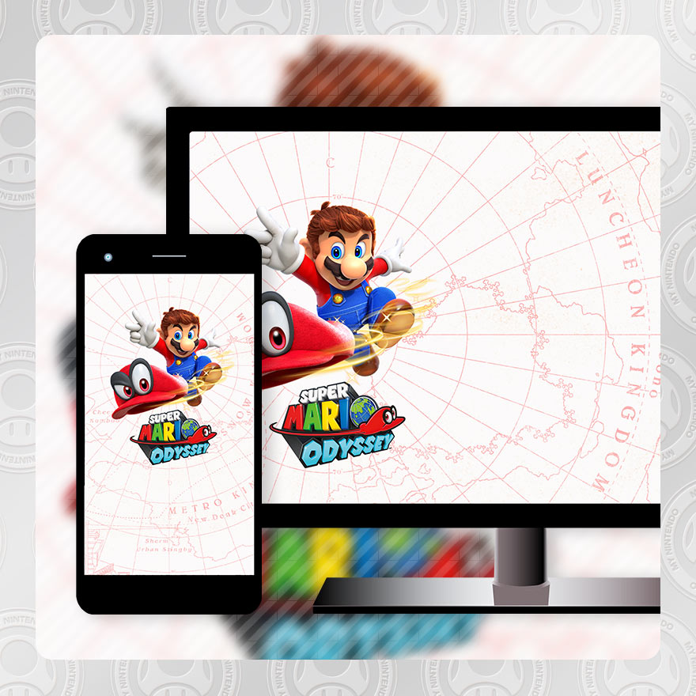

### About

Explore incredible places far from the Mushroom Kingdom as you join Mario and his new ally Cappy on a massive, globe-trotting 3D adventure. 

Use amazing new abilities—like the power to capture and control objects, animals, and enemies—to collect Power Moons so you can power up the Odyssey airship and save Princess Peach from Bowser’s wedding plans! 

[Super Mario Odyssey™](http://supermario.nintendo.com/) is available on Nintendo Switch on October 27, 2017!

Enjoying the song? Download a short, free version of Jump Up, Super Star! [here](http://supermario.com)!

---

### Landscape (PC/Tablet)

<a href="./nin-wall/smo-white/Landscape/1280x1024.jpg" download="Super Mario Odyssey (White Theme) (Landscape) - 1280x1024.png">1280x1024</a> | <a href="./nin-wall/smo-white/Landscape/1366x768.jpg" download="Super Mario Odyssey (White Theme) (Landscape) - 1366x768.png">1366x768</a> | <a href="./nin-wall/smo-white/Landscape/1920x1080.jpg" download="Super Mario Odyssey (White Theme) (Landscape) - 1920x1080.png">1920x1080</a> | <a href="./nin-wall/smo-white/Landscape/2560x1440.jpg" download="Super Mario Odyssey (White Theme) (Landscape) - 2560x1440.png">2560x1440</a> | <a href="./nin-wall/smo-white/Landscape/3840x2160.jpg" download="Super Mario Odyssey (White Theme) (Landscape) - 3840x2160.png">3840x2160</a>

---

### Portrait (Mobile)

<a href="./nin-wall/smo-white/Portrait/640x1136.jpg" download="Super Mario Odyssey (White Theme) (Portrait) - 640x1136.png">640x1136</a> | <a href="./nin-wall/smo-white/Portrait/720x1280.jpg" download="Super Mario Odyssey (White Theme) (Portrait) - 720x1280.png">720x1280</a> | <a href="./nin-wall/smo-white/Portrait/750x1334.jpg" download="Super Mario Odyssey (White Theme) (Portrait) - 750x1334.png">750x1334</a> | <a href="./nin-wall/smo-white/Portrait/1080x1920.jpg" download="Super Mario Odyssey (White Theme) (Portrait) - 1080x1920.png">1080x1920</a> | <a href="./nin-wall/smo-white/Portrait/1242x2208.jpg" download="Super Mario Odyssey (White Theme) (Portrait) - 1242x2208.png">1242x2208</a> | <a href="./nin-wall/smo-white/Portrait/1440x2560.jpg" download="Super Mario Odyssey (White Theme) (Portrait) - 1440x2560.png">1440x2560</a>

---

---

## Super Mario Odyssey (Pixel Mario)

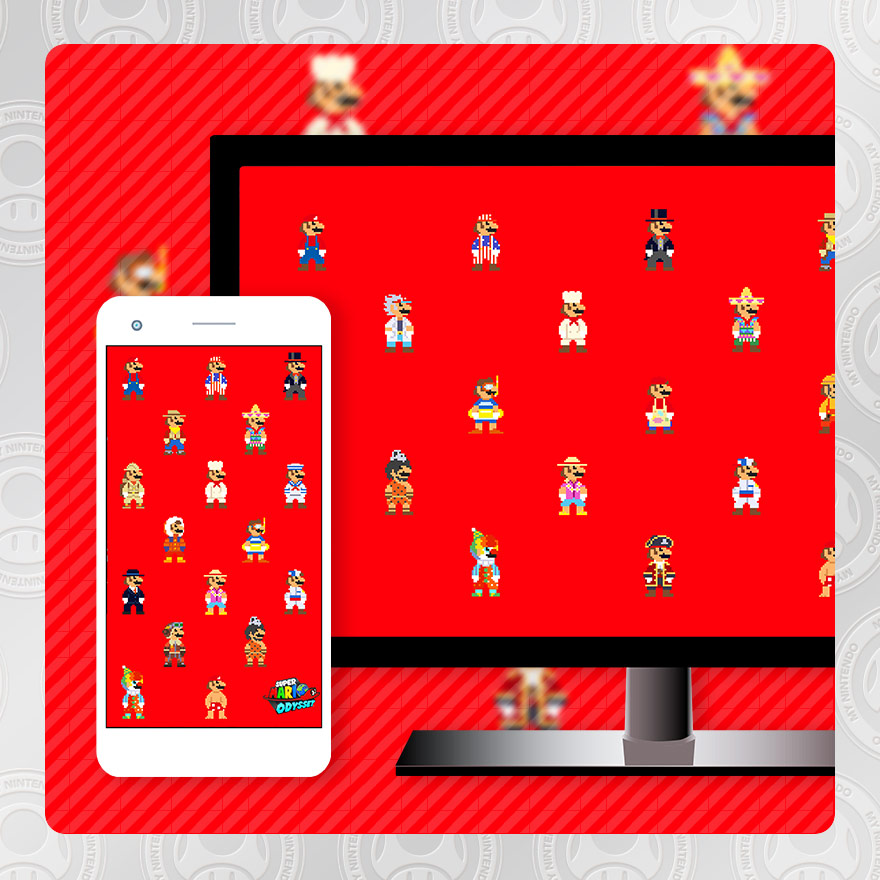

### About

Explore incredible places far from the Mushroom Kingdom as you join Mario and his new ally Cappy on a massive, globe-trotting 3D adventure. 

Use amazing new abilities—like the power to capture and control objects, animals, and enemies—to collect Power Moons so you can power up the Odyssey airship and save Princess Peach from Bowser’s wedding plans! 

[Super Mario Odyssey™](http://supermario.nintendo.com/) is available on Nintendo Switch on October 27, 2017!

Enjoying the song? Download a short, free version of Jump Up, Super Star! [here](http://supermario.com)!

---

### Landscape (PC/Tablet)

<a href="./nin-wall/smo-pixel/Landscape/1280x1024.jpg" download="Super Mario Odyssey (Pixel Mario) (Landscape) - 1280x1024.png">1280x1024</a> | <a href="./nin-wall/smo-pixel/Landscape/1366x768.jpg" download="Super Mario Odyssey (Pixel Mario) (Landscape) - 1366x768.png">1366x768</a> | <a href="./nin-wall/smo-pixel/Landscape/1920x1080.jpg" download="Super Mario Odyssey (Pixel Mario) (Landscape) - 1920x1080.png">1920x1080</a> | <a href="./nin-wall/smo-pixel/Landscape/2560x1440.jpg" download="Super Mario Odyssey (Pixel Mario) (Landscape) - 2560x1440.png">2560x1440</a> | <a href="./nin-wall/smo-pixel/Landscape/3840x2160.jpg" download="Super Mario Odyssey (Pixel Mario) (Landscape) - 3840x2160.png">3840x2160</a>

---

### Portrait (Mobile)

<a href="./nin-wall/smo-pixel/Portrait/640x1136.jpg" download="Super Mario Odyssey (Pixel Mario) (Portrait) - 640x1136.png">640x1136</a> | <a href="./nin-wall/smo-pixel/Portrait/720x1280.jpg" download="Super Mario Odyssey (Pixel Mario) (Portrait) - 720x1280.png">720x1280</a> | <a href="./nin-wall/smo-pixel/Portrait/750x1334.jpg" download="Super Mario Odyssey (Pixel Mario) (Portrait) - 750x1334.png">750x1334</a> | <a href="./nin-wall/smo-pixel/Portrait/1080x1920.jpg" download="Super Mario Odyssey (Pixel Mario) (Portrait) - 1080x1920.png">1080x1920</a> | <a href="./nin-wall/smo-pixel/Portrait/1242x2208.jpg" download="Super Mario Odyssey (Pixel Mario) (Portrait) - 1242x2208.png">1242x2208</a> | <a href="./nin-wall/smo-pixel/Portrait/1440x2560.jpg" download="Super Mario Odyssey (Pixel Mario) (Portrait) - 1440x2560.png">1440x2560</a>

---

---

## Star Fox™ 2

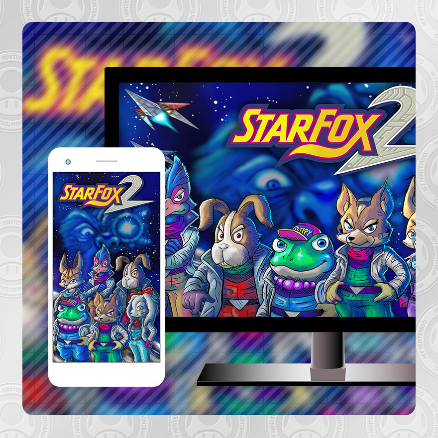

### About

The wait is finally over. 

The Super NES Classic Edition system is now available! Play 20 classic Super NES games, plus the never-before-released Star Fox™ 2 game. 

For more information about the game, visit [official site](https://www.nintendo.com/super-nes-classic).

 

 

 

---

### Landscape (PC/Tablet)

<a href="./nin-wall/star-fox-2/Landscape/1280x1024.jpg" download="Star Fox™ 2 (Landscape) - 1280x1024.png">1280x1024</a> | <a href="./nin-wall/star-fox-2/Landscape/1366x768.jpg" download="Star Fox™ 2 (Landscape) - 1366x768.png">1366x768</a> | <a href="./nin-wall/star-fox-2/Landscape/1920x1080.jpg" download="Star Fox™ 2 (Landscape) - 1920x1080.png">1920x1080</a> | <a href="./nin-wall/star-fox-2/Landscape/2560x1440.jpg" download="Star Fox™ 2 (Landscape) - 2560x1440.png">2560x1440</a> | <a href="./nin-wall/star-fox-2/Landscape/3840x2160.jpg" download="Star Fox™ 2 (Landscape) - 3840x2160.png">3840x2160</a>

---

### Portrait (Mobile)

<a href="./nin-wall/star-fox-2/Portrait/640x1136.jpg" download="Star Fox™ 2 (Portrait) - 640x1136.png">640x1136</a> | <a href="./nin-wall/star-fox-2/Portrait/720x1280.jpg" download="Star Fox™ 2 (Portrait) - 720x1280.png">720x1280</a> | <a href="./nin-wall/star-fox-2/Portrait/750x1334.jpg" download="Star Fox™ 2 (Portrait) - 750x1334.png">750x1334</a> | <a href="./nin-wall/star-fox-2/Portrait/1080x1920.jpg" download="Star Fox™ 2 (Portrait) - 1080x1920.png">1080x1920</a> | <a href="./nin-wall/star-fox-2/Portrait/1242x2208.jpg" download="Star Fox™ 2 (Portrait) - 1242x2208.png">1242x2208</a> | <a href="./nin-wall/star-fox-2/Portrait/1440x2560.jpg" download="Star Fox™ 2 (Portrait) - 1440x2560.png">1440x2560</a>

---

---

## Sonic Forces

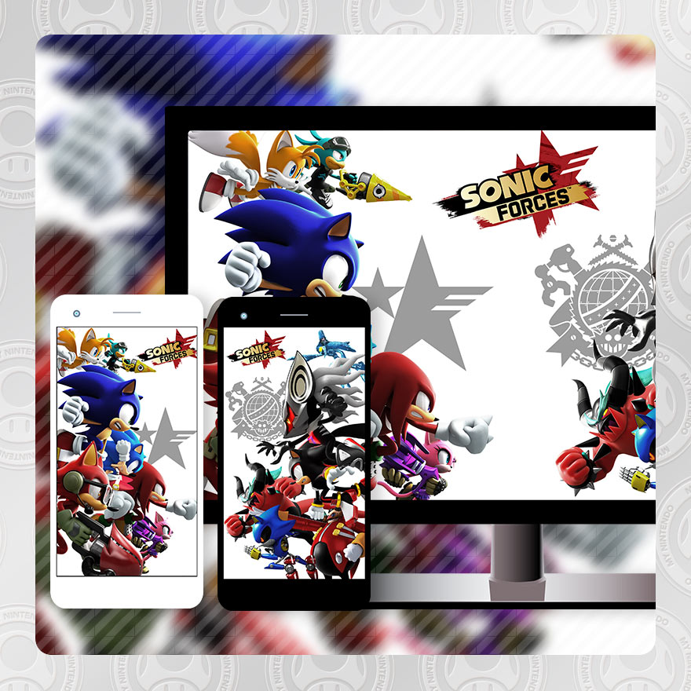

### About

Join the Uprising.

From the team that brought you Sonic Colors and Generations, comes the next exciting title in the Sonic franchise, Sonic Forces.

Experience fast-paced action as Modern Sonic, thrilling platforming as Classic Sonic, and utilize powerful new gadgets as your own custom Hero Character. 

Help Sonic fight back to reclaim the world from Dr. Eggman and a powerful, mysterious new villain.

 

 

---

### Landscape (PC/Tablet)

<a href="./nin-wall/sonic-forces/Landscape/1280x1024.jpg" download="Sonic Forces (Landscape) - 1280x1024.png">1280x1024</a> | <a href="./nin-wall/sonic-forces/Landscape/1366x768.jpg" download="Sonic Forces (Landscape) - 1366x768.png">1366x768</a> | <a href="./nin-wall/sonic-forces/Landscape/1920x1080.jpg" download="Sonic Forces (Landscape) - 1920x1080.png">1920x1080</a> | <a href="./nin-wall/sonic-forces/Landscape/2560x1440.jpg" download="Sonic Forces (Landscape) - 2560x1440.png">2560x1440</a> | <a href="./nin-wall/sonic-forces/Landscape/3840x2160.jpg" download="Sonic Forces (Landscape) - 3840x2160.png">3840x2160</a>

---

### Portrait (Heroes) (Mobile)

<a href="./nin-wall/sonic-forces/Portrait - Heroes/640x1136.jpg" download="Sonic Forces (Portrait - Heroes) - 640x1136.png">640x1136</a> | <a href="./nin-wall/sonic-forces/Portrait - Heroes/720x1280.jpg" download="Sonic Forces (Portrait - Heroes) - 720x1280.png">720x1280</a> | <a href="./nin-wall/sonic-forces/Portrait - Heroes/750x1334.jpg" download="Sonic Forces (Portrait - Heroes) - 750x1334.png">750x1334</a> | <a href="./nin-wall/sonic-forces/Portrait - Heroes/1080x1920.jpg" download="Sonic Forces (Portrait - Heroes) - 1080x1920.png">1080x1920</a> | <a href="./nin-wall/sonic-forces/Portrait - Heroes/1242x2208.jpg" download="Sonic Forces (Portrait - Heroes) - 1242x2208.png">1242x2208</a> | <a href="./nin-wall/sonic-forces/Portrait - Heroes/1440x2560.jpg" download="Sonic Forces (Portrait - Heroes) - 1440x2560.png">1440x2560</a>

### Portrait (Villains) (Mobile)

<a href="./nin-wall/sonic-forces/Portrait - Villains/640x1136.jpg" download="Sonic Forces (Portrait - Villains) - 640x1136.png">640x1136</a> | <a href="./nin-wall/sonic-forces/Portrait - Villains/720x1280.jpg" download="Sonic Forces (Portrait - Villains) - 720x1280.png">720x1280</a> | <a href="./nin-wall/sonic-forces/Portrait - Villains/750x1334.jpg" download="Sonic Forces (Portrait - Villains) - 750x1334.png">750x1334</a> | <a href="./nin-wall/sonic-forces/Portrait - Villains/1080x1920.jpg" download="Sonic Forces (Portrait - Villains) - 1080x1920.png">1080x1920</a> | <a href="./nin-wall/sonic-forces/Portrait - Villains/1242x2208.jpg" download="Sonic Forces (Portrait - Villains) - 1242x2208.png">1242x2208</a> | <a href="./nin-wall/sonic-forces/Portrait - Villains/1440x2560.jpg" download="Sonic Forces (Portrait - Villains) - 1440x2560.png">1440x2560</a>

---

---

## Pokémon Crystal

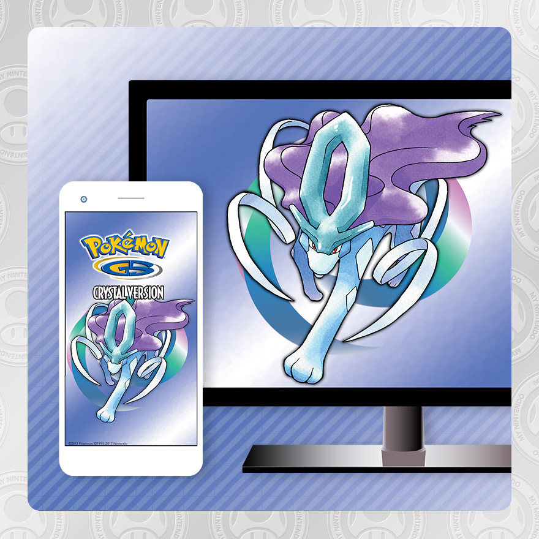

### About

Pokémon Crystal is back and brimming with new features on Jan. 26, 2018 Originally released for the Game Boy™ Color system in 2000, the Pokémon™ Crystal game added several new features to the Pokémon franchise. 

For the first time, players could choose a female or male character, Pokémon battles featured animation, and more. 

And now, this Virtual Console release invites you to explore the Johto region again—or for the first time.

  • Experience an adventure through Johto based on the Pokémon Gold and Pokémon Silver games, but with updated features and added story elements.

  • Get the chance to encounter the Mythical Pokémon Celebi in an event after completing the main adventure.

  • Meet the mysterious character Eusine and find out how he’s linked to the Legendary Pokémon Suicune.

  • Battle and trade with friends using local wireless.*

  • With the paid service Pokémon Bank, you’ll be able to bring Pokémon you have caught in Pokémon Crystal into the Pokémon Sun, Pokémon Moon, Pokémon Ultra Sun, and Pokémon Ultra Moon games!

For more info, please visit the [Game Store](https://www.nintendo.com/games/detail/pokemon-crystal-version-3ds). 

---

### Landscape (PC/Tablet)

<a href="./nin-wall/pkmn-crystal/Landscape/1280x1024.jpg" download="Pokémon Crystal (Landscape) - 1280x1024.png">1280x1024</a> | <a href="./nin-wall/pkmn-crystal/Landscape/1366x768.jpg" download="Pokémon Crystal (Landscape) - 1366x768.png">1366x768</a> | <a href="./nin-wall/pkmn-crystal/Landscape/1920x1080.jpg" download="Pokémon Crystal (Landscape) - 1920x1080.png">1920x1080</a> | <a href="./nin-wall/pkmn-crystal/Landscape/2560x1440.jpg" download="Pokémon Crystal (Landscape) - 2560x1440.png">2560x1440</a> | <a href="./nin-wall/pkmn-crystal/Landscape/3840x2160.jpg" download="Pokémon Crystal (Landscape) - 3840x2160.png">3840x2160</a>

---

### Portrait (Mobile)

<a href="./nin-wall/pkmn-crystal/Portrait/640x1136.jpg" download="Pokémon Crystal (Portrait) - 640x1136.png">640x1136</a> | <a href="./nin-wall/pkmn-crystal/Portrait/720x1280.jpg" download="Pokémon Crystal (Portrait) - 720x1280.png">720x1280</a> | <a href="./nin-wall/pkmn-crystal/Portrait/750x1334.jpg" download="Pokémon Crystal (Portrait) - 750x1334.png">750x1334</a> | <a href="./nin-wall/pkmn-crystal/Portrait/1080x1920.jpg" download="Pokémon Crystal (Portrait) - 1080x1920.png">1080x1920</a> | <a href="./nin-wall/pkmn-crystal/Portrait/1242x2208.jpg" download="Pokémon Crystal (Portrait) - 1242x2208.png">1242x2208</a> | <a href="./nin-wall/pkmn-crystal/Portrait/1440x2560.jpg" download="Pokémon Crystal (Portrait) - 1440x2560.png">1440x2560</a>

---

---

## Pokémon Ultra Sun™ and Pokémon Ultra Moon™

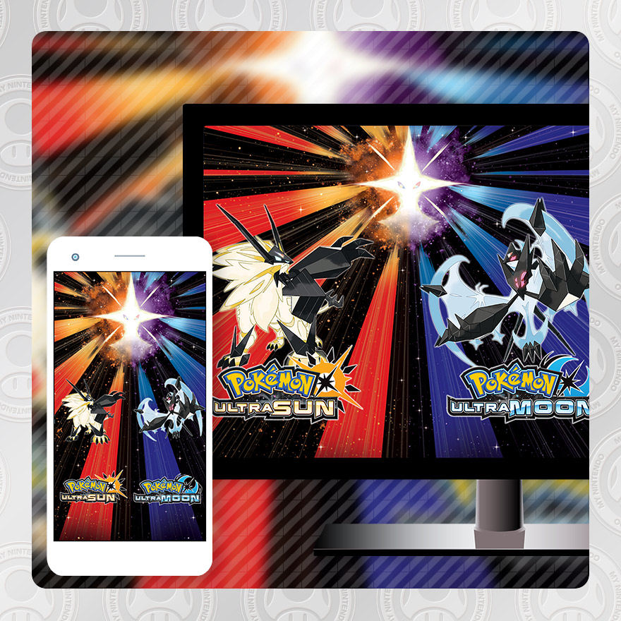

### About

A new light shines on the Alola region!

Take on the role of a Pokémon™ Trainer and unravel the mystery of the Legendary Pokémon Necrozma's new forms: Dusk Mane Necrozma in the Pokémon Ultra Sun game and Dawn Wings Necrozma in the Pokémon Ultra Moon game. You can encounter and battle 400+ Pokémon, including new forms. A brand-new showdown awaits!

Discover the Legendary Pokémon Solgaleo and Lunala's new Z-Moves and their mysterious connection to the Legendary Pokémon Necrozma. Then venture into Ultra Wormholes to explore the Ultra Beasts' home world, encounter every Legendary Pokémon, and uncover Ultra Megalopolis, a dark world where Necrozma has stolen the light. On the bright side, the Alola region has new activities, and fresh landscapes to explore with some assistance from your powered-up Rotom Dex. You'll need all the help you can get if you're going to stop Giovanni, Ghetsis, and the rest of Team Rainbow Rocket from taking over the Alola region!
For more info, please visit the [official site](https://www.pokemon-sunmoon.com/ultra/en-us/). 

---

### Landscape (PC/Tablet)

<a href="./nin-wall/pkmn-usum/Landscape/1280x1024.jpg" download=" Pokémon Ultra Sun™ and Pokémon Ultra Moon™ (Landscape) - 1280x1024.png">1280x1024</a> | <a href="./nin-wall/pkmn-usum/Landscape/1366x768.jpg" download=" Pokémon Ultra Sun™ and Pokémon Ultra Moon™ (Landscape) - 1366x768.png">1366x768</a> | <a href="./nin-wall/pkmn-usum/Landscape/1920x1080.jpg" download=" Pokémon Ultra Sun™ and Pokémon Ultra Moon™ (Landscape) - 1920x1080.png">1920x1080</a> | <a href="./nin-wall/pkmn-usum/Landscape/2560x1440.jpg" download=" Pokémon Ultra Sun™ and Pokémon Ultra Moon™ (Landscape) - 2560x1440.png">2560x1440</a> | <a href="./nin-wall/pkmn-usum/Landscape/3840x2160.jpg" download=" Pokémon Ultra Sun™ and Pokémon Ultra Moon™ (Landscape) - 3840x2160.png">3840x2160</a>

---

### Portrait (Mobile)

<a href="./nin-wall/pkmn-usum/Portrait/640x1136.jpg" download=" Pokémon Ultra Sun™ and Pokémon Ultra Moon™ (Portrait) - 640x1136.png">640x1136</a> | <a href="./nin-wall/pkmn-usum/Portrait/720x1280.jpg" download=" Pokémon Ultra Sun™ and Pokémon Ultra Moon™ (Portrait) - 720x1280.png">720x1280</a> | <a href="./nin-wall/pkmn-usum/Portrait/750x1334.jpg" download=" Pokémon Ultra Sun™ and Pokémon Ultra Moon™ (Portrait) - 750x1334.png">750x1334</a> | <a href="./nin-wall/pkmn-usum/Portrait/1080x1920.jpg" download=" Pokémon Ultra Sun™ and Pokémon Ultra Moon™ (Portrait) - 1080x1920.png">1080x1920</a> | <a href="./nin-wall/pkmn-usum/Portrait/1242x2208.jpg" download=" Pokémon Ultra Sun™ and Pokémon Ultra Moon™ (Portrait) - 1242x2208.png">1242x2208</a> | <a href="./nin-wall/pkmn-usum/Portrait/1440x2560.jpg" download=" Pokémon Ultra Sun™ and Pokémon Ultra Moon™ (Portrait) - 1440x2560.png">1440x2560</a>

---

---

## Fire Emblem Warriors – Shield of Flames

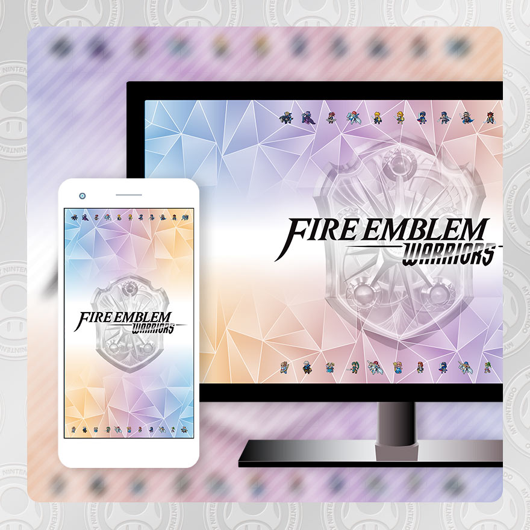

### About

Heroes from across the Fire Emblem universe collide!

Clash with legions of soldiers and fierce monsters as Marth, Xander, Corrin, and other Fire Emblem heroes unleashing over-the-top-powerful Dynasty Warriors-style moves. 

Take direct control of known and original Fire Emblem characters, issue them strategic commands in the midst of battle, pair up heroes to unleash stunning attacks, and more. 

Unlock new playable heroes, each with their own unique moves, special attacks, weapon types, and voiced dialogue in this large-scale action game from the Hyrule Warriors team.

Fight massive battles as your favorite heroes, anywhere. Fire Emblem Warriors on Nintendo Switch now available.

---

### Landscape (PC/Tablet)

<a href="./nin-wall/few-shield-of-flames/Landscape/1280x1024.jpg" download="Fire Emblem Warriors – Shield of Flames (Landscape) - 1280x1024.png">1280x1024</a> | <a href="./nin-wall/few-shield-of-flames/Landscape/1366x768.jpg" download="Fire Emblem Warriors – Shield of Flames (Landscape) - 1366x768.png">1366x768</a> | <a href="./nin-wall/few-shield-of-flames/Landscape/1920x1080.jpg" download="Fire Emblem Warriors – Shield of Flames (Landscape) - 1920x1080.png">1920x1080</a> | <a href="./nin-wall/few-shield-of-flames/Landscape/2560x1440.jpg" download="Fire Emblem Warriors – Shield of Flames (Landscape) - 2560x1440.png">2560x1440</a> | <a href="./nin-wall/few-shield-of-flames/Landscape/3840x2160.jpg" download="Fire Emblem Warriors – Shield of Flames (Landscape) - 3840x2160.png">3840x2160</a>

---

### Portrait (Mobile)

<a href="./nin-wall/few-shield-of-flames/Portrait/640x1136.jpg" download="Fire Emblem Warriors – Shield of Flames (Portrait) - 640x1136.png">640x1136</a> | <a href="./nin-wall/few-shield-of-flames/Portrait/720x1280.jpg" download="Fire Emblem Warriors – Shield of Flames (Portrait) - 720x1280.png">720x1280</a> | <a href="./nin-wall/few-shield-of-flames/Portrait/750x1334.jpg" download="Fire Emblem Warriors – Shield of Flames (Portrait) - 750x1334.png">750x1334</a> | <a href="./nin-wall/few-shield-of-flames/Portrait/1080x1920.jpg" download="Fire Emblem Warriors – Shield of Flames (Portrait) - 1080x1920.png">1080x1920</a> | <a href="./nin-wall/few-shield-of-flames/Portrait/1242x2208.jpg" download="Fire Emblem Warriors – Shield of Flames (Portrait) - 1242x2208.png">1242x2208</a> | <a href="./nin-wall/few-shield-of-flames/Portrait/1440x2560.jpg" download="Fire Emblem Warriors – Shield of Flames (Portrait) - 1440x2560.png">1440x2560</a>

---

---

## Fire Emblem Warriors – Worlds Unite

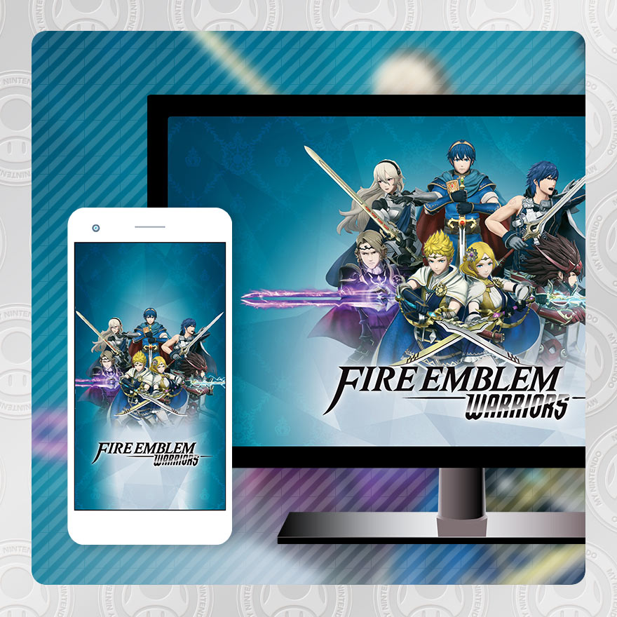

### About

Heroes from across the Fire Emblem universe collide!

Clash with legions of soldiers and fierce monsters as Marth, Xander, Corrin, and other Fire Emblem heroes unleashing over-the-top-powerful Dynasty Warriors-style moves. 

Take direct control of known and original Fire Emblem characters, issue them strategic commands in the midst of battle, pair up heroes to unleash stunning attacks, and more. 

Unlock new playable heroes, each with their own unique moves, special attacks, weapon types, and voiced dialogue in this large-scale action game from the Hyrule Warriors team.

Fight massive battles as your favorite heroes, anywhere. Fire Emblem Warriors on Nintendo Switch now available.

---

### Landscape (PC/Tablet)

<a href="./nin-wall/few-worlds-unite/Landscape/1280x1024.jpg" download="Fire Emblem Warriors – Worlds Unite (Landscape) - 1280x1024.png">1280x1024</a> | <a href="./nin-wall/few-worlds-unite/Landscape/1366x768.jpg" download="Fire Emblem Warriors – Worlds Unite (Landscape) - 1366x768.png">1366x768</a> | <a href="./nin-wall/few-worlds-unite/Landscape/1920x1080.jpg" download="Fire Emblem Warriors – Worlds Unite (Landscape) - 1920x1080.png">1920x1080</a> | <a href="./nin-wall/few-worlds-unite/Landscape/2560x1440.jpg" download="Fire Emblem Warriors – Worlds Unite (Landscape) - 2560x1440.png">2560x1440</a> | <a href="./nin-wall/few-worlds-unite/Landscape/3840x2160.jpg" download="Fire Emblem Warriors – Worlds Unite (Landscape) - 3840x2160.png">3840x2160</a>

---

### Portrait (Mobile)

<a href="./nin-wall/few-worlds-unite/Portrait/640x1136.jpg" download="Fire Emblem Warriors – Worlds Unite (Portrait) - 640x1136.png">640x1136</a> | <a href="./nin-wall/few-worlds-unite/Portrait/720x1280.jpg" download="Fire Emblem Warriors – Worlds Unite (Portrait) - 720x1280.png">720x1280</a> | <a href="./nin-wall/few-worlds-unite/Portrait/750x1334.jpg" download="Fire Emblem Warriors – Worlds Unite (Portrait) - 750x1334.png">750x1334</a> | <a href="./nin-wall/few-worlds-unite/Portrait/1080x1920.jpg" download="Fire Emblem Warriors – Worlds Unite (Portrait) - 1080x1920.png">1080x1920</a> | <a href="./nin-wall/few-worlds-unite/Portrait/1242x2208.jpg" download="Fire Emblem Warriors – Worlds Unite (Portrait) - 1242x2208.png">1242x2208</a> | <a href="./nin-wall/few-worlds-unite/Portrait/1440x2560.jpg" download="Fire Emblem Warriors – Worlds Unite (Portrait) - 1440x2560.png">1440x2560</a>

---

---
