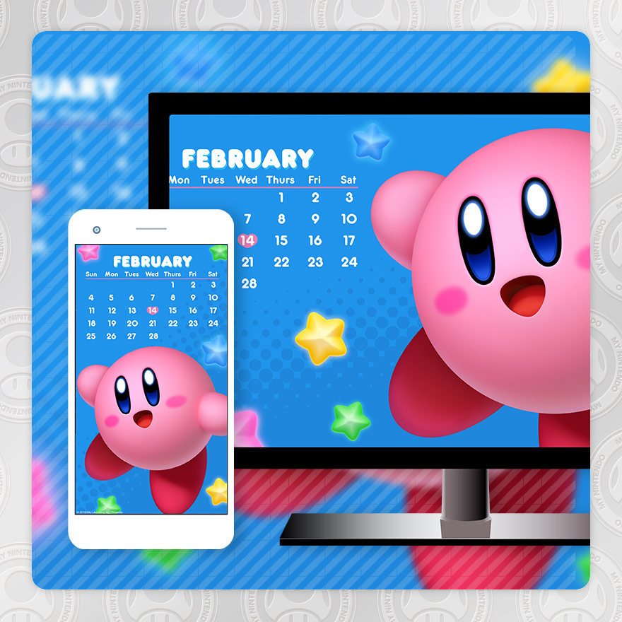

<!---
./feb-cal-kirby = February Calender - Kirby
./snes-classic = The Super NES Classic Edition
./dragon-ball-xeno-2 = DRAGON BALL Xenoverse 2
./arms-black = ARMS - Black Theme
./arms-min-min = ARMS - Min Min
./arms-spring-man = ARMS - Spring Man
./tloz-pack-2 = The Legend of Zelda: Breath of the Wild - The Champions' Ballad DLC Pack 2
./tloz-master-cycle = The Legend of Zelda: Breath of the Wild – The Master Cycle Zero
./xc2-argentum = Xenoblade Chronicles 2 - Argentum Trade Guild
./xc2-uraya = Xenoblade Chronicles 2 – Kingdom of Uraya
./metroid-c = [Wallpaper C] Metroid: Samus Returns
./metroid-d = [Wallpaper D] Metroid: Samus Returns
./smo-red = Super Mario Odyssey (Red Theme)
./smo-white = Super Mario Odyssey (White Theme)
./smo-pixel = Super Mario Odyssey (Pixel Mario)
./star-fox-2 = Star Fox™ 2
./sonic-forces = Sonic Forces
./pkmn-crystal = Pokémon Crystal
./pkmn-usum = Pokémon Ultra Sun™ and Pokémon Ultra Moon™
./few-shield-of-flames = Fire Emblem Warriors – Shield of Flames
./few-worlds-unite = Fire Emblem Warriors – Worlds Unite
-->
# Table of Contents
- [February Calender - Kirby](#february-calender---kirby)
- ARMS
  - [Black Theme](#arms---black-theme)
  - [Min Min](#arms---min-min)
  - [Spring Man](#arms---spring-man)
- [SNES Clasic Edition](#the-super-nes-classic-edition)
- [Dragon Ball Xenoverse 2](#dragon-ball-xenoverse-2)
- The Legend of Zelda: Breath of the Wild
  - [The Champions' Ballad DLC Pack 2](#the-legend-of-zelda-breath-of-the-wild---the-champions-ballad-dlc-pack-2)
  - [The Master Cycle Zero](#the-legend-of-zelda-breath-of-the-wild--the-master-cycle-zero)
- Xenoblade Chronicles 2
  - [Argentum Trade Guild](#xenoblade-chronicles-2---argentum-trade-guild)
  - [Kingdom of Uraya](#xenoblade-chronicles-2--kingdom-of-uraya)
- Metroid: Samus Returns
  - [Wallpaper C](#wallpaper-c-metroid-samus-returns)
  - [Wallpaper D](#wallpaper-d-metroid-samus-returns)
- Super Mario Odyssey
  - [Red Theme](#super-mario-odyssey-red)
  - [White Theme](#super-mario-odyssey-white)
  - [Pixel Mario](#super-mario-odyssey-pixel-mario)
- [Star Fox™ 2](#star-fox-2)
- [Sonic Forces](#sonic-forces)
- Pokémon
  - [Pokémon Crystal](#pokémon-crystal)
  - [Pokémon Ultra Sun™ and Pokémon Ultra Moon™](#pokémon-ultra-sun-and-pokémon-ultra-moon)
- Fire Emblem Warriors
  - [Shield of Flames](#fire-emblem-warriors--shield-of-flames)
  - [Worlds Unite](#fire-emblem-warriors--worlds-unite)
  
---

## February Calender - Kirby
 > test

## The Super NES Classic Edition

## DRAGON BALL Xenoverse 2

## ARMS - Black Theme
## ARMS - Min Min
## ARMS - Spring Man

## The Legend of Zelda: Breath of the Wild - The Champions' Ballad DLC Pack 2
## The Legend of Zelda: Breath of the Wild – The Master Cycle Zero

## Xenoblade Chronicles 2 - Argentum Trade Guild
## Xenoblade Chronicles 2 – Kingdom of Uraya

## [Wallpaper C] Metroid: Samus Returns
## [Wallpaper D] Metroid: Samus Returns

## Super Mario Odyssey (Red Theme)
## Super Mario Odyssey (White Theme)
## Super Mario Odyssey (Pixel Mario)

## Star Fox™ 2

## Sonic Forces

## Pokémon Crystal
## Pokémon Ultra Sun™ and Pokémon Ultra Moon™

## Fire Emblem Warriors – Shield of Flames
## Fire Emblem Warriors – Worlds Unite


> This is a blockquote following a header.
>
> When something is important enough, you do it even if the odds are not in your favor.

### [](#header-3)Header 3

```js
// Javascript code with syntax highlighting.
var fun = function lang(l) {
  dateformat.i18n = require('./lang/' + l)
  return true;
}
```

```ruby
# Ruby code with syntax highlighting
GitHubPages::Dependencies.gems.each do |gem, version|
  s.add_dependency(gem, "= #{version}")
end
```

#### [](#header-4)Header 4

*   This is an unordered list following a header.
*   This is an unordered list following a header.
*   This is an unordered list following a header.

##### [](#header-5)Header 5

1.  This is an ordered list following a header.
2.  This is an ordered list following a header.
3.  This is an ordered list following a header.

###### [](#header-6)Header 6

| head1        | head two          | three |
|:-------------|:------------------|:------|
| ok           | good swedish fish | nice  |
| out of stock | good and plenty   | nice  |
| ok           | good `oreos`      | hmm   |
| ok           | good `zoute` drop | yumm  |

### There's a horizontal rule below this.

* * *

### Here is an unordered list:

*   Item foo
*   Item bar
*   Item baz
*   Item zip

### And an ordered list:

1.  Item one
1.  Item two
1.  Item three
1.  Item four

### And a nested list:

- level 1 item
  - level 2 item
  - level 2 item
    - level 3 item
    - level 3 item
- level 1 item
  - level 2 item
  - level 2 item
  - level 2 item
- level 1 item
  - level 2 item
  - level 2 item
- level 1 item

### Small image


### Large image


### Definition lists can be used with HTML syntax.

<dl>
<dt>Name</dt>
<dd>Godzilla</dd>
<dt>Born</dt>
<dd>1952</dd>
<dt>Birthplace</dt>
<dd>Japan</dd>
<dt>Color</dt>
<dd>Green</dd>
</dl>

```
Long, single-line code blocks should not wrap. They should horizontally scroll if they are too long. This line should be long enough to demonstrate this.
```

```
The final element.
```
